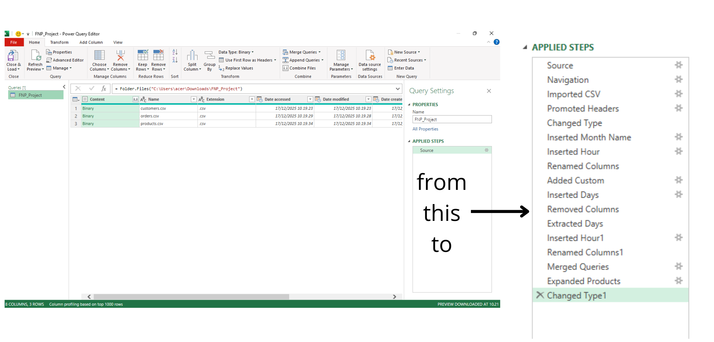
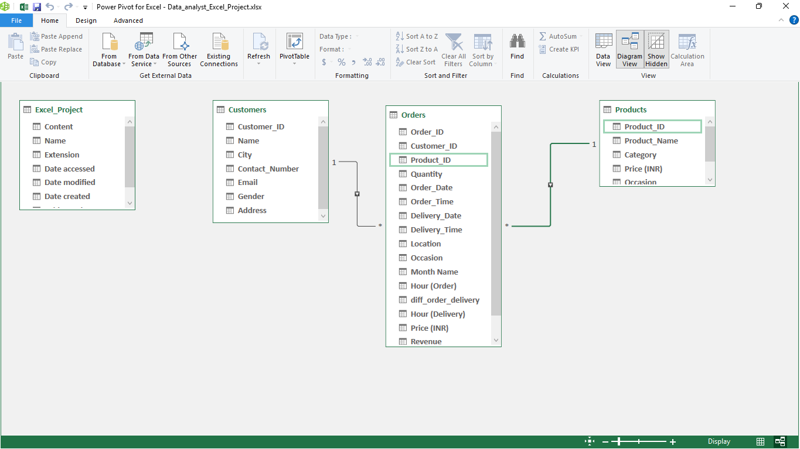
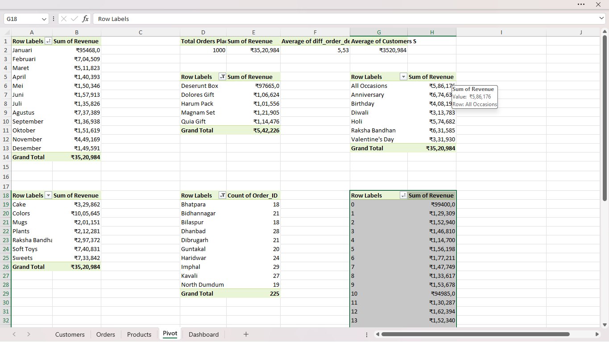

# Introduction
This report presents an analytical overview of a gift store Ferns and Petals (FNP) dataset, that specializes in sending gifts for various occasions like Diwali, Raksha Bandhan, Holi, Valentine's Day, Birthdays, and Anniversaries. The goal is to identify key sales trends, understand product and customer behavior, and examine geographical sales distribution. This analysis provides insights that can help optimize business decisions, improve sales strategies, and enhance customer experiences.

# Background
Data hails from [Github](https://github.com/Ayushi0214/FNP---Excel-Project/tree/main/fnp%20datasets). It's packed with insights on Customers, Orders and Products

### The question I want to answer through my Microsoft Excel Analysis :

1. Total Revenue: Identify the overall revenue.
2. Average Order and Delivery Time: Evaluate the time taken for orders to be delivered.
3. Monthly Sales Performance: Examine how sales fluctuate across the months of 2023.
4. Top Products by Revenue: Determine which products are the top revenue generators.
5. Customer Spending Analysis: Understand how much customers are spending on
average.
6. Sales Performance by Top 5 Product: Track the sales performance of top 5 products.
7. Top 10 Cities by Number of Orders: Find out which cities are placing the highest
number of orders.
8. Revenue Comparison Between Occasions: Compare revenue generated across
different occasions.
9. Product Popularity by Occasion: Identify which products are most popular during
specific occasions.

# Tools I Used 
For my deep dive into the data analyst FNP, I harnessed the power of several key tools on Microsoft Excel:

- **Power Query:** The backbone of my Excel analysis, used to extract, clean, and transform raw grocery store data into a structured and analysis-ready format.
- **Excel Sheet:** The primary data management environment, where the cleaned dataset is stored, explored, and prepared for analysis.
- **Pivot Table:** My main analytical tool for summarizing data, performing aggregations, and replicating SQL-like operations such as grouping, filtering, and calculated fields.
- **Chart:** Used to visualize insights and trends, making the analysis easier to interpret, communicate, and present to stakeholders.

# The Analysis
### 1. Transforming Dataset Using Power Query
In this project, I processed and analyzed the FNP dataset entirely using Microsoft Excel. My workflow began with importing raw data and cleaning it using Power Query, ensuring consistency in formats, handling missing values, and preparing the dataset for analysis.

 

### 2. Build Data Modeling and Analysis Using Power Pivot and Pivot Tables
Once the data was structured, I used Power Pivot to Manage the data model and build a connection that i can analyzing all the data in the pivot tables letter. 

 

After that, I used Pivot Tables to explore the data from multiple perspectives, enabling me to perform aggregations, filtering, and comparisons efficiently. Each analysis step was carefully designed to answer specific business questions aligned with the objectives of this project.

 

### 3. Build an Interactive Dashboard
This structured Excel-based approach enabled me to transform raw data into meaningful insights and present them clearly through tables and visualizations.:

 
### Insight from Dashboard:
**1. Overall Performance** :
- The business recorded 1,000 total orders with a total revenue of ₹3,520,984, indicating strong overall sales performance.
- The average customer spending** is approximately ₹3,521 per order, suggesting a relatively high transaction value.
- The average order-to-delivery time of 5.53 units reflects an efficient fulfillment process.

**2. Revenue by Occasion**
- Anniversary and Raksha Bandhan are the top-performing occasions, generating the highest revenue among all events.
- Diwali and Valentine’s Day show comparatively lower revenue, indicating potential opportunities for targeted promotions or improved product offerings during these occasions.

**3. Revenue by Category**
- The Colors category contributes the highest revenue, making it the most profitable product category.
- Soft Toys and Sweets also perform strongly, highlighting customer preference for gift-oriented items.
- Categories such as Mugs and Plants show lower revenue, suggesting room for optimization through bundling or pricing strategies.

**4. Revenue by Order Time (Hourly Trend)**
- Revenue peaks during the evening hours (around 18:00–21:00), indicating that most customers place orders after working hours.
- This insight can be leveraged to schedule marketing campaigns, flash sales, or push notifications during peak ordering times.

**5. Monthly Revenue Trend**
- Revenue shows noticeable spikes in February and August, which align with major gifting seasons and festivals.
- Months with lower revenue present opportunities for off-season promotions to stabilize sales throughout the year.

**6. Top Products by Revenue**
- Magnam Set is the highest revenue-generating product, followed closely by Quia Gift and Dolores Gift.
- These top-performing products can be prioritized in marketing campaigns and inventory planning.

**7. Top Cities by Orders**
- Imphal, Kavali, and Dhanbad are among the cities with the highest number of orders.
- High-performing cities can be targeted for localized marketing, faster delivery services, or expansion strategies.

# What I Learned
Throughout this project, I strengthened my data analysis skills by leveraging Microsoft Excel as the primary analytical tool:

- **Data Cleaning & Transformation (Power Query):** Learned how to efficiently clean, transform, and structure raw data using Power Query, including handling missing values, standardizing formats, and preparing datasets for analysis.
- **Data Aggregation & Analysis (Pivot Tables)** Developed strong skills in summarizing large datasets using Pivot Tables to perform aggregations, filtering, and comparisons.
- **Analytical Thinking & Problem Solving** Improved my ability to translate business questions into structured analytical steps, identify key performance metrics, and extract actionable insights from data.
- **Data Visualization & Reporting** Gained experience in creating clear and meaningful charts and dashboards to communicate insights effectively to stakeholders.

# Conclusions
Through this deep dive into the FNP data set, several key insights emerged that can guide stakeholder to make a great decesion.

1. The analysis shows 1,000 total orders with a total revenue of ₹3,520,984, indicating strong overall sales performance.
2. Anniversary and Raksha Bandhan are the highest revenue-generating occasions, highlighting the importance of event-based sales.
3. The Colors category is the top contributor to revenue, followed by Soft Toys and Sweets, reflecting strong customer demand for gift-related products.
4. Order activity peaks during the evening hours (18:00–21:00), suggesting optimal timing for promotions and marketing campaigns.
5. Monthly revenue trends reveal significant spikes in February and August, aligned with major gifting seasons.
6. Magnam Set, Quia Gift, and Dolores Gift are the top-performing products by revenue.
7. Cities such as Imphal, Kavali, and Dhanbad record the highest number of orders, indicating strong regional demand.

**Final Thought :**

This project demonstrates how Microsoft Excel can be effectively used as a powerful data analysis tool when combined with structured thinking and clear business objectives. By utilizing Power Query, Pivot Tables, and data visualizations, I was able to transform raw grocery store data into meaningful insights that support data-driven decision-making. Beyond technical skills, this project strengthened my analytical mindset—learning how to ask the right questions, interpret patterns, and communicate insights clearly. This experience serves as a solid foundation for tackling more complex data analysis projects in the future.

